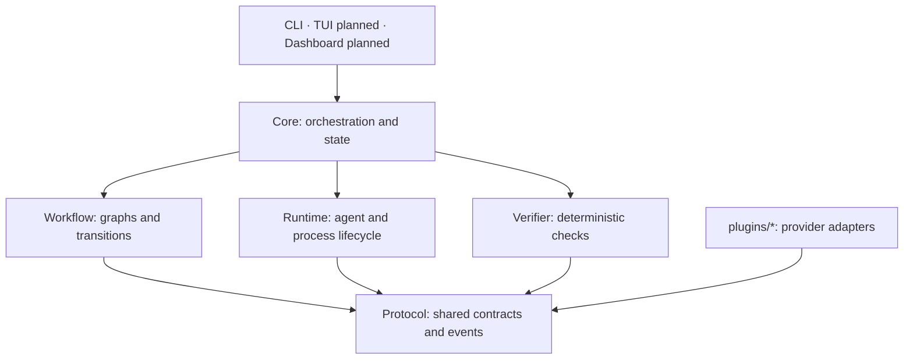

# Veyra

[](https://github.com/iamzjt-front-end/veyra/actions/workflows/ci.yml)

**One goal. Many agents. Verified execution.**

Veyra coordinates planners, coding agents, deterministic checks and reviewers in provider-neutral local workflows. Declare the steps in YAML, inspect their evidence, and resume from saved state with explicit human approval where needed.

```text
plan → execute → verify → review → complete
          ↑        │        │
          └── fix ←┴────────┘
```

The product is **Veyra**. Its command is **`ve`**, its official npm scope is **`@veyraoss`**, and project files remain **`veyra.yaml`** and **`.veyra/`**.

**Current state:** the headless CLI, workflow engine and provider adapters are implemented and covered by deterministic tests. The full live v0.1 smoke remains blocked by provider setup. TUI and Dashboard are planned surfaces. npm packages are verified local candidates and **have not been published**; use the source checkout today. See the [roadmap](docs/ROADMAP.md) and [exact implementation status](docs/TODO.md).

## What it does

- Runs declarative agent, command, approval, branch, parallel, subworkflow and consensus steps with explicit retry/deadline limits.
- Keeps deterministic verification separate from model review, with structured events and inspectable local evidence.
- Persists workflow snapshots and supports pause/resume, bounded artifacts and conservative recovery after interruption.
- Supports provider combinations and explicitly trusted local plugins through shared contracts.
- Offers optional Git worktrees and human gates while preserving native agent permission controls.

## Quick start

One-time setup requires Node.js >=20 and pnpm 10.15.1. CI verifies Node.js 22 on macOS and Linux; native Windows is currently unsupported. Cold dependency installation/build time varies.

```sh
git clone https://github.com/iamzjt-front-end/veyra.git
cd veyra
corepack enable
pnpm install --frozen-lockfile
pnpm build
```

### 60-second local tour

After setup, this provider-free example pauses before a real Node version check. It uses a temporary project and needs no API key:

```sh
demo_dir="$(mktemp -d)"
cp examples/gallery/human-approval/* "$demo_dir/"
pnpm ve -- workflow validate ./workflow.yaml --config "$demo_dir/veyra.yaml"
pnpm ve -- run "Inspect Node after my approval" --config "$demo_dir/veyra.yaml" --non-interactive
pnpm ve -- status --config "$demo_dir/veyra.yaml" --json
```

The run exits **3** because it is waiting for approval; the command has not executed. Keep these as separate commands rather than chaining after the paused run with `&&`. Inspect the returned run and approval IDs, then approve that exact operation:

```sh
pnpm ve -- resume <run-id> --config "$demo_dir/veyra.yaml" --approve --approval-id <approval-id>
pnpm ve -- review --config "$demo_dir/veyra.yaml" --json
```

Resume executes the check, records its result under the temporary project's `.veyra/`, and exits **0**. `--reject` refuses the operation. No unattended flag supplies approval.

For a coding workflow, choose a complete configuration from the [example gallery](examples/gallery/README.md), replace model placeholders, install the target project's dependencies and run `pnpm ve -- doctor --config /absolute/project/veyra.yaml`. Review its commands and provider permissions before running agents. The [installation guide](docs/INSTALLATION.md) covers global installation verification, future registry installation, upgrades and removal.

## Providers

All listed adapters have deterministic tests. Readiness checks and successful fixture tests do not prove that an account can reach a model or that a live task will succeed.

| Provider                                               | Implemented surface                                  | Live verification in this checkout                                      |
| ------------------------------------------------------ | ---------------------------------------------------- | ----------------------------------------------------------------------- |
| [OpenAI](docs/OPENAI.md)                               | Responses planner/reviewer/judge                     | Full closed-loop smoke blocked by missing API credential                |
| [Codex](docs/CODEX.md)                                 | Native coding CLI                                    | Native fixture smoke verified; full OpenAI + Codex loop remains blocked |
| [Claude](docs/CLAUDE.md)                               | API planner/reviewer/judge                           | Smoke blocked by missing Anthropic credential                           |
| [Claude Code](docs/CLAUDE-CODE.md)                     | Native coding CLI                                    | Smoke blocked by native request timeouts                                |
| [Gemini](docs/GEMINI.md)                               | API reasoning and opt-in inline image input          | Smoke blocked by missing API credential                                 |
| [Gemini CLI](docs/GEMINI-CLI.md)                       | Native coding CLI                                    | Native executable unavailable for live verification                     |
| [OpenCode](docs/OPENCODE.md)                           | Native coding CLI                                    | Smoke blocked by rejected native provider credentials                   |
| [OpenAI-compatible / local](docs/OPENAI-COMPATIBLE.md) | Explicit Chat Completions endpoint and response mode | Loopback HTTP integration verified; no universal backend/model claim    |

The gallery includes GPT + Codex, Claude + Codex, GPT + Claude Code, cross-model review, parallel reviewers, human approval, bugfix, supplied-source research and headless CI. Provider identifiers and models remain configuration choices; Core contains no vendor selection assumptions.

## Architecture



Package boundaries remain stable even when a surface is planned. The CLI injects adapters; Runtime handles execution and Core coordinates the workflow. Config owns parsing/defaults, and SDK owns extension registration. Read [Architecture](docs/ARCHITECTURE.md) for ownership and dependency rules.

There is no stable TUI demo yet: bare `ve` prints CLI help. The TUI milestone waits for the live vertical-slice exit gate, and Dashboard implementation waits for TUI stability. The local tour above demonstrates current CLI behavior.

## Safety and limits

Workflows, project scripts and trusted plugins can execute code with local privileges. Worktrees and approval prompts are not an OS sandbox. Review commands, plugin dependencies and native permissions; explicitly gate publishing, deployment, destructive operations and credential access. Agent text is not a source of verifier commands.

Veyra redacts known secrets at managed boundaries, but cannot guarantee that arbitrary third-party code or native tools never write sensitive data. Do not attach raw histories or credentials to public issues. Recovery refuses uncertain partial effects; retries do not make arbitrary external actions idempotent. Read the [command safety model](docs/COMMAND-SAFETY.md), [authentication limits](docs/AUTHENTICATION.md), [recovery contract](docs/CRASH-RECOVERY.md) and [private security reporting policy](SECURITY.md).

## Development

After the setup above, run the complete baseline:

```sh
pnpm lint
pnpm format:check
pnpm check
pnpm test
pnpm build
pnpm ve -- doctor
```

If Corepack reports `Cannot find matching keyid`, [update Corepack](https://pnpm.io/10.x/installation#using-corepack) to a compatible release. Corepack 0.34.7 was verified with Node.js 22.22.0 and the pinned pnpm version. Use `pnpm format` for Prettier formatting; Biome lint and TypeScript checks remain separate.

CI runs the five baseline checks and frozen installation on macOS 15 arm64 and Ubuntu 24.04 x64. Default tests use disposable projects and need no provider credentials. See [local development](docs/DEVELOPMENT.md), [testing](docs/TESTING.md) and the [platform policy](docs/PLATFORMS.md).

Read [CONTRIBUTING.md](CONTRIBUTING.md), [AGENTS.md](AGENTS.md) and the [next eligible TODO](docs/TODO.md#next-task) before changing code. Use `pnpm packages:check` for isolated tarball checks and `pnpm installation:check` for the separate real npm global-install check. [Versioning](docs/VERSIONING.md), [changelogs](CHANGELOG.md) and [release CI](docs/RELEASING.md) cover preparation; public publication requires explicit human approval.

## Documentation

The [documentation index](docs/README.md) links the CLI, configuration, workflow and provider references, state/safety contracts, author tutorials and project policies. Start with the [workflow tutorial](docs/tutorials/WORKFLOW.md) or [plugin tutorial](docs/tutorials/PLUGIN.md).

[Issues and community channels](docs/COMMUNITY.md) · [Code of Conduct](CODE_OF_CONDUCT.md) · [Roadmap](docs/ROADMAP.md) · [Master TODO](docs/TODO.md)

## License

[MIT](LICENSE).
