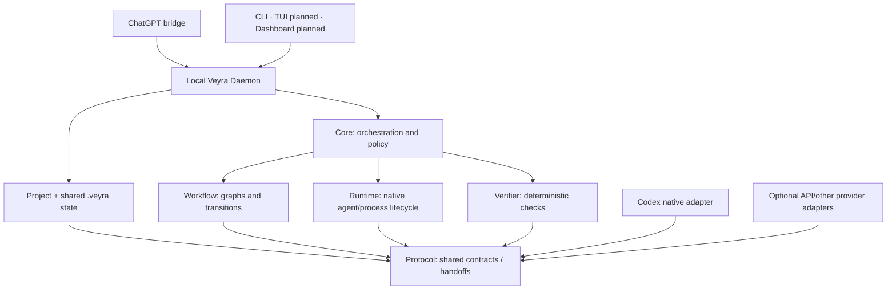

# Veyra

[](https://github.com/iamzjt-front-end/veyra/actions/workflows/ci.yml)

**Your project. Your agents. One shared context.**

Veyra is a **project-centered control plane for the AI tools you already use**.

Its first product goal is simple: let ChatGPT plan/review a project change, let an already-authenticated native Codex execute it in the selected local project, then return the implementation evidence to ChatGPT automatically — without the developer manually copying messages between them.

```text
ChatGPT
  ↓ plan / review
Veyra Project + Bridge + Daemon
  ↓
Codex Native
  ↓ edit / test / diff
Veyra shared state + verifier
  ↓
ChatGPT
```

The golden path is **native-auth-first**. It should reuse Codex's normal existing ChatGPT login and **must not require `OPENAI_API_KEY`**. API providers remain optional integrations for users who explicitly want them.

Read [`PRODUCT.md`](PRODUCT.md) for the canonical product definition.

The current ChatGPT Pro proof uses the [Experimental Browser Bridge](apps/chatgpt-extension/README.md), connecting Chrome/Chromium directly to the local daemon. The official MCP adapter remains available for future verified Full MCP access. Real-account acceptance is still pending in P0.12.

The product is **Veyra**. Its command is **`ve`**, its official npm scope is **`@veyraoss`**, and project-owned state lives under **`.veyra/`**.

**Current state:** the orchestration engine, workflow DSL, local runtime/verifier, persisted state, native Codex adapter, optional API adapters, safety hardening and release tooling are implemented and heavily tested. The current P0 work is the Project/Daemon/ChatGPT bridge that turns those foundations into the original product: a real ChatGPT → Codex → ChatGPT loop with no manual copy/paste and no API key required for the core path. npm packages are verified local candidates and **have not been published**.

See the [roadmap](docs/ROADMAP.md) and [canonical TODO](docs/TODO.md).

## What Veyra is building first

The first-class object is a **Veyra Project**, backed by a real local folder:

```text
~/Projects/my-app/
├── src/
├── tests/
├── ...
└── .veyra/
    ├── project.yaml
    ├── state.json
    ├── context/
    ├── handoffs/
    ├── runs/
    └── artifacts/
```

The project folder is the shared workspace. `.veyra/` is the durable shared engineering state between tools that otherwise have separate native conversations/sessions.

Veyra does **not** need ChatGPT and Codex to expose or share their entire chat histories. It shares bounded project state such as goals, plans, acceptance criteria, decisions, changed files, verification evidence, review verdicts and next actions.

P0 introduces:

- first-class Project identity and a lightweight local Project Registry;
- a local Veyra Daemon and typed local tool/IPC API;
- native Codex readiness/session continuity using its existing authentication;
- a versioned planner/executor/reviewer handoff contract;
- a ChatGPT bridge selected through an official supported integration where possible, with an isolated experimental bridge only if needed for the proof;
- a real ChatGPT → Codex → ChatGPT closed loop;
- automatic bounded review/fix iteration.

## Existing foundation

The current repository already:

- runs declarative agent, command, approval, branch, parallel, subworkflow and consensus steps with explicit retry/deadline limits;
- keeps deterministic verification separate from model review, with structured events and inspectable local evidence;
- persists workflow snapshots and supports pause/resume, bounded artifacts and conservative recovery after interruption;
- supports provider combinations and explicitly trusted local plugins through shared contracts;
- includes native Codex/runtime integrations and optional API-provider adapters;
- offers optional Git worktrees and human gates while preserving native agent permission controls;
- includes package/release/security/evaluation tooling that remains useful after the product pivot.

## Quick start

One-time setup requires Node.js >=20 and pnpm 10.15.1. CI verifies Node.js 22 on macOS and Linux; native Windows is currently unsupported. Cold dependency installation/build time varies.

```sh
git clone https://github.com/iamzjt-front-end/veyra.git
cd veyra
corepack enable
pnpm install --frozen-lockfile
pnpm build
```

### Provider-free local tour

After setup, this provider-free example pauses before a real Node version check. It uses a temporary project and needs no API key:

```sh
demo_dir="$(mktemp -d)"
cp examples/gallery/human-approval/* "$demo_dir/"
pnpm ve -- workflow validate ./workflow.yaml --config "$demo_dir/veyra.yaml"
pnpm ve -- run "Inspect Node after my approval" --config "$demo_dir/veyra.yaml" --non-interactive
pnpm ve -- status --config "$demo_dir/veyra.yaml" --json
```

The run exits **3** because it is waiting for approval; the command has not executed. Keep these as separate commands rather than chaining after the paused run with `&&`. Inspect the returned run and approval IDs, then approve that exact operation:

```sh
pnpm ve -- resume <run-id> --config "$demo_dir/veyra.yaml" --approve --approval-id <approval-id>
pnpm ve -- review --config "$demo_dir/veyra.yaml" --json
```

Resume executes the check, records its result under the temporary project's `.veyra/`, and exits **0**. `--reject` refuses the operation. No unattended flag supplies approval.

This tour demonstrates current local workflow behavior, not the unfinished ChatGPT bridge. Follow [`docs/TODO.md`](docs/TODO.md) for the P0 bridge implementation status.

## Native-first vs optional API providers

The P0 golden path is:

```text
ChatGPT surface → Veyra → native Codex → verifier → ChatGPT surface
```

Codex should reuse its normal installed/authenticated client state. Missing `OPENAI_API_KEY` is not a P0 failure.

Existing API integrations remain available as optional capabilities:

| Integration                                            | Implemented surface                                  | Product role now                                             |
| ------------------------------------------------------ | ---------------------------------------------------- | ------------------------------------------------------------ |
| [Codex](docs/CODEX.md)                                 | Native coding CLI                                    | **P0 executor / native golden path**                         |
| [OpenAI](docs/OPENAI.md)                               | Responses planner/reviewer/judge                     | Optional API integration; live API key smoke is non-blocking |
| [Claude](docs/CLAUDE.md)                               | API planner/reviewer/judge                           | Optional/deferred until GPT ↔ Codex product proof            |
| [Claude Code](docs/CLAUDE-CODE.md)                     | Native coding CLI                                    | Optional/deferred additional native executor                 |
| [Gemini](docs/GEMINI.md)                               | API reasoning and opt-in inline image input          | Optional/deferred                                            |
| [Gemini CLI](docs/GEMINI-CLI.md)                       | Native coding CLI                                    | Optional/deferred                                            |
| [OpenCode](docs/OPENCODE.md)                           | Native coding CLI                                    | Optional/deferred                                            |
| [OpenAI-compatible / local](docs/OPENAI-COMPATIBLE.md) | Explicit Chat Completions endpoint and response mode | Optional local/API-compatible integration                    |

Provider identifiers and models remain configuration choices. Core contains no vendor-selection assumptions.

## Architecture



The ChatGPT bridge is a replaceable surface. The Project owns durable coordination state. The Daemon exposes project-scoped local operations. Runtime handles native process/session lifecycle. Core coordinates workflow semantics. Verifier provides objective evidence.

Read [Architecture](docs/ARCHITECTURE.md) for ownership and dependency rules.

## P0 success criterion

Veyra's first meaningful product milestone is not an API adapter test. It is this real demo:

```text
User asks ChatGPT for a project change
        ↓
ChatGPT produces/chooses the plan
        ↓
Veyra sends a structured handoff automatically
        ↓
Native Codex changes the bound project
        ↓
Veyra verifies and packages the result
        ↓
The result returns to the same ChatGPT workflow automatically
        ↓
ChatGPT reviews it and either finishes or sends a repair
```

No manual copy/paste between GPT and Codex. No OpenAI API key required for this core path.

TUI and Dashboard are downstream management surfaces built on the same Project/Daemon model; they are not substitutes for this product proof.

## Safety and limits

Veyra sends no external product telemetry. Run evidence and metrics remain local; configured providers and native tools follow their own execution and data policies. See the [telemetry policy](docs/TELEMETRY.md).

Workflows, project scripts, native coding agents and trusted plugins can execute code with local privileges. Worktrees and approval prompts are not an OS sandbox. Review commands, plugin dependencies and native permissions; explicitly gate publishing, deployment, destructive operations and credential access. Agent text is not a source of verifier commands.

Veyra redacts known secrets at managed boundaries, but cannot guarantee that arbitrary third-party code or native tools never write sensitive data. Do not attach raw histories or credentials to public issues. Recovery refuses uncertain partial effects; retries do not make arbitrary external actions idempotent. Read the [command safety model](docs/COMMAND-SAFETY.md), [authentication limits](docs/AUTHENTICATION.md), [recovery contract](docs/CRASH-RECOVERY.md) and [private security reporting policy](SECURITY.md).

The planned ChatGPT bridge must be explicitly installed/authorized and project-scoped. It must not silently harvest unrelated conversations or treat identity login as blanket chat-history access.

## Development

After setup, run the complete baseline:

```sh
pnpm lint
pnpm format:check
pnpm check
pnpm test
pnpm build
pnpm ve -- doctor
```

If Corepack reports `Cannot find matching keyid`, [update Corepack](https://pnpm.io/10.x/installation#using-corepack) to a compatible release. Corepack 0.34.7 was verified with Node.js 22.22.0 and the pinned pnpm version. Use `pnpm format` for Prettier formatting; Biome lint and TypeScript checks remain separate.

CI runs the five baseline checks and frozen installation on macOS 15 arm64 and Ubuntu 24.04 x64. Default tests use disposable projects and need no provider credentials. See [local development](docs/DEVELOPMENT.md), [testing](docs/TESTING.md) and the [platform policy](docs/PLATFORMS.md).

Read [`PRODUCT.md`](PRODUCT.md), [CONTRIBUTING.md](CONTRIBUTING.md), [AGENTS.md](AGENTS.md) and the [next eligible TODO](docs/TODO.md#next-task) before changing code. Public publication requires explicit human approval.

## Documentation

The [documentation index](docs/README.md) links CLI, configuration, workflow/provider references, state/safety contracts, author tutorials and project policies.

[Product definition](PRODUCT.md) · [Architecture](docs/ARCHITECTURE.md) · [Roadmap](docs/ROADMAP.md) · [Master TODO](docs/TODO.md) · [Issues/community](docs/COMMUNITY.md)

## License

[MIT](LICENSE).
